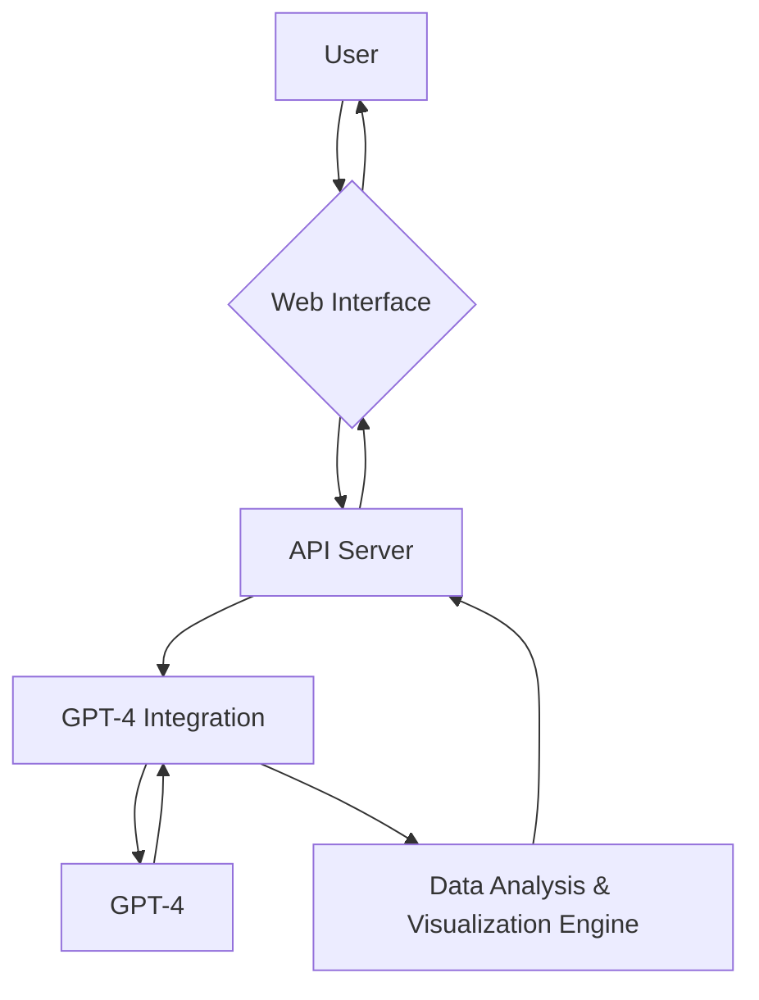
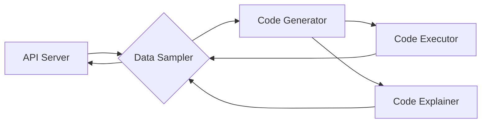
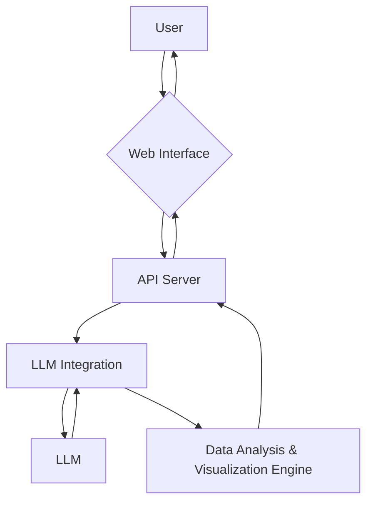

# Code Interpreter Systems Design

### Components

#### 1. Web Interface

The web interface will allow users to:

- Upload data files (CSV, GIF, etc.)
- Input a text prompt describing their desired output
- View the executed visualizations or data manipulations
- Download the resulting artifacts (graphs, images, videos, etc.)

#### 2. API Server

The API server will handle requests from the web interface and interact with the GPT-4 integration and the Data Analysis & Visualization Engine. It will be responsible for:

- Accepting and processing user data uploads
- Sending text prompts and data to GPT-4 for processing
- Receiving suggestions and generated code from GPT-4
- Executing the generated code and rendering visualizations
- Handling errors and retries in the code execution process

#### 3. GPT-4 Integration

The GPT-4 integration will be responsible for:

- Communicating with the GPT-4 API
- Sending user data and text prompts to GPT-4 for processing
- Receiving and processing GPT-4 responses
- Extracting visualization suggestions and generated code

#### 4. Data Analysis & Visualization Engine

This combined component will:

- Parse various data formats (CSV, GIF, etc.)
- Perform basic data processing tasks (e.g., cleaning, filtering)
- Generate visualizations or manipulate data based on GPT-4 suggestions and generated code (using libraries like D3.js, Chart.js, Plotly.js, FFmpeg for video processing, etc.)
- Generate and execute the code to create the desired output
- Handle errors and retries in the code execution process

### Workflow

1. The user uploads a data file and inputs a text prompt through the web interface.
2. The web interface sends the data file and text prompt to the API server.
3. The API server processes the data file and sends the data and text prompt to GPT-4 for processing.
4. GPT-4 processes the data and text prompt, generating visualization or data manipulation suggestions and code.
5. The GPT-4 integration extracts the suggestions and code from the GPT-4 response and sends them to the Data Analysis & Visualization Engine.
6. The Data Analysis & Visualization Engine generates and executes the code, creating the desired output, handling any errors or retries as needed.
7. The API server sends the visualizations or manipulated data and any resulting artifacts back to the web interface.
8. The web interface displays the results to the user and allows them to download any artifacts.

### Code Interpreter Workflow Diagram

## Data Analysis & Visualization Engine

### Workflow

1. The Data Sampler receives the data from the API Server and samples it if necessary.

2. The sampled data and the text prompt are sent to GPT-4 for processing.
   GPT-4 processes the sampled data and text prompt, generating visualization or data manipulation suggestions and code.

3. The Code Generator receives the suggestions from the GPT-4 Integration and generates executable code.

4. The Code Executor executes the generated code on the entire dataset, handles any errors or retries, and produces the final artifacts.
   The Code Explainer generates an explanation of the code.

5. The Data Analysis & Visualization Engine returns the artifacts, the code, and the code explanation to the API Server.

---

### Short, revised:

# Code Interpreter System Design

### Components

#### 1. Web Interface

Allows users to upload data, input prompts, view outputs, and download resulting artifacts.

#### 2. API Server

Handles user requests, interacts with LLM, and executes generated code to produce visualizations.

#### 3. LLM Integration

Facilitates communication with LLM API, sending user data and prompts, and extracting results.

#### 4. Data Analysis & Visualization Engine

Performs data parsing and processing, code generation and execution, error handling, and artifact creation.

### Workflow

1. User interacts with Web Interface to upload data and input prompts.
2. API Server sends data and prompts to LLM via LLM Integration.
3. LLM suggests visualizations and generates code.
4. Data Analysis & Visualization Engine executes code, creates output, and handles errors.
5. API Server returns results to Web Interface for user download.

### Workflow Diagram

## Data Analysis & Visualization Engine Workflow

1. Data Sampler receives and samples data, if necessary.
2. Code Generator receives suggestions from LLM and generates executable code.
3. Code Executor runs code on full dataset and creates artifacts.
4. Code Explainer provides a human-readable explanation of the code.
5. Engine returns artifacts, code, and code explanation to API Server.

### Engine Workflow Diagram

